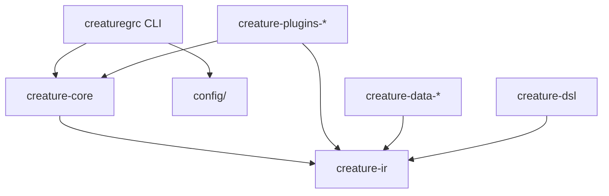

# CreatureGRC Workspace

This repository uses a **monorepo workspace architecture** with clear boundaries and contracts.

## Structure

```
CreatureGRC/
├── packages/                  # Internal workspace packages (dev-time modules)
│   ├── creature-ir/           # ✅ THE ONLY PUBLIC CONTRACT
│   ├── creature-dsl/          # DSL parser & compiler
│   ├── creature-core/         # Core engines (scan/map/audit)
│   ├── creature-plugins-*/    # Scanner plugins (Netbox, AWS, etc.)
│   └── creature-data-*/       # Framework data (NIST, SOC2, ISO)
│
├── src/creaturegrc/           # Main package (what pip installs)
│   ├── cli.py                 # Typer CLI (thin wrapper)
│   ├── config/                # Configuration management
│   └── __init__.py            # Re-exports from packages/*
│
├── database/                  # PostgreSQL schemas & migrations
├── deployments/               # Docker Compose files
├── config/                    # Configuration templates
├── tests/                     # Testing infrastructure
│   ├── conformance/           # Plugin contract tests
│   ├── integration/           # Integration tests with DB
│   └── e2e/                   # End-to-end CLI/API tests
│
├── docs/                      # Documentation
│   ├── adr/                   # Architecture Decision Records
│   └── commands.md            # User documentation
│
└── pyproject.toml             # Workspace root configuration
```

## Key Principles

### 1. Contract-First Architecture

**`creature-ir` is the ONLY public API contract.**

- All other packages are internal implementation details
- Breaking changes to `creature-ir` require:
  - Major version bump
  - ADR (Architecture Decision Record)
  - Compatibility tests passing

### 2. Plugin Architecture

Plugins are discovered via entry points:

```python
[project.entry-points."creaturegrc.plugins.scanners"]
netbox = "creature_plugins_netbox:NetboxScanner"
aws = "creature_plugins_aws:AWSScanner"
```

All plugins must pass the conformance test suite in `tests/conformance/`.

### 3. Deployment Modes

**Agent Mode** (lightweight):
- `pip install creaturegrc[agent]`
- No database, export-only
- Profile support for consultants managing multiple clients

**Server Mode** (full platform):
- `pip install creaturegrc[server]`
- PostgreSQL database
- Full API and integrations

**Both**:
- `pip install creaturegrc` (auto-detects mode)
- `docker compose up` (server deployment)

## Development Workflow

### Setup

```bash
# Install uv (fast Python package manager)
curl -LsSf https://astral.sh/uv/install.sh | sh

# Clone repository
git clone https://github.com/yokoszn/CreatureGRC.git
cd CreatureGRC

# Install workspace dependencies
uv sync

# Install pre-commit hooks
pre-commit install
```

### Working on Packages

```bash
# Work on a specific package
cd packages/creature-ir
uv run pytest

# Run from workspace root
uv run pytest packages/creature-ir/

# Build unified package
uv build

# Install locally
pip install dist/*.whl
```

### Testing

```bash
# Run all tests
uv run pytest

# Unit tests only (fast)
uv run pytest -m unit

# Integration tests (require database)
uv run pytest -m integration

# Conformance tests (plugin contract)
uv run pytest tests/conformance/

# E2E tests (full system)
uv run pytest -m e2e
```

### Adding a New Plugin

1. Create package structure:
   ```bash
   mkdir -p packages/creature-plugins-myservice/src/creature_plugins_myservice
   ```

2. Implement scanner interface:
   ```python
   from creature_core import ScannerPlugin
   from creature_ir import Creature

   class MyServiceScanner(ScannerPlugin):
       def scan(self) -> list[Creature]:
           # Implementation
           pass
   ```

3. Register entry point in `pyproject.toml`:
   ```toml
   [project.entry-points."creaturegrc.plugins.scanners"]
   myservice = "creature_plugins_myservice:MyServiceScanner"
   ```

4. Add conformance tests:
   ```python
   # tests/conformance/test_myservice_plugin.py
   def test_myservice_scanner_conformance(myservice_scanner):
       assert_scanner_conforms(myservice_scanner)
   ```

## Configuration

### Agent Configuration

Profiles stored in `~/.config/creaturegrc/profiles/`:

```bash
# Create profile
creaturegrc profile create acme-corp \
  --server-url https://grc.acmecorp.com \
  --api-key-file ~/.config/creaturegrc/credentials/acme-key

# Switch profile
creaturegrc profile use acme-corp

# Run command with specific profile
creaturegrc --profile widgets-inc status --framework soc2
```

### Server Configuration

System config in `/etc/creaturegrc/server.toml`:

```toml
[database]
host = "localhost"
port = 5432
name = "grc_platform"
user = "grc_user"
password_file = "/run/secrets/db_password"

[api]
enabled = true
host = "0.0.0.0"
port = 8080
```

See `config/examples/` for complete examples.

## Architecture Decisions

See `docs/adr/` for Architecture Decision Records:

- [ADR-001: Configuration Architecture](docs/adr/001-configuration-architecture.md)

## Contributing

1. Fork the repository
2. Create a feature branch
3. Make changes
4. Run tests: `uv run pytest`
5. Run linters: `pre-commit run --all-files`
6. Submit pull request

## Release Process

Releases use per-package semantic versioning:

1. Update version in `pyproject.toml`
2. Create git tag: `git tag v2.0.0`
3. Push tag: `git push --tags`
4. GitHub Actions builds and publishes to PyPI

## Package Dependencies



**Key**: Only `creature-ir` is a public contract. Everything else is internal.

## Questions?

- 📚 **Documentation**: See `docs/` directory
- 🐛 **Issues**: https://github.com/yokoszn/CreatureGRC/issues
- 💬 **Discussions**: https://github.com/yokoszn/CreatureGRC/discussions
