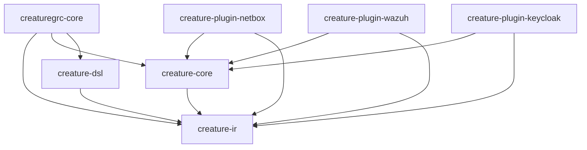

# Backstage Integration

CreatureGRC integrates with [Backstage](https://backstage.io/) to provide:

- **Service Catalog**: Discover and track all CreatureGRC components
- **API Documentation**: Auto-generated API docs from code
- **TechDocs**: Unified documentation portal
- **Dependency Graphs**: Visualize component relationships
- **Ownership Tracking**: Clear ownership and responsibilities

## What is Backstage?

Backstage is an open-source platform for building developer portals. It provides:

- Centralized software catalog
- Scaffolding for creating new services
- Technical documentation (TechDocs)
- Plugin ecosystem
- Search across all services

## CreatureGRC in Backstage

### System Overview

CreatureGRC is registered as a **System** in Backstage with the following components:

```yaml
System: creaturegrc
├── Component: creaturegrc-core (Main package)
├── Component: creature-ir (Contract)
├── Component: creature-core (Engines)
├── Component: creature-dsl (DSL Parser)
├── Component: creaturegrc-database
└── Plugins:
    ├── creature-plugin-netbox
    ├── creature-plugin-wazuh
    └── creature-plugin-keycloak
```

### APIs Defined

- **creaturegrc-rest-api**: REST API for agent-server communication (OpenAPI spec)
- **creaturegrc-cli-api**: CLI commands reference
- **creature-ir-api**: Pydantic model definitions (the stable contract)

### Component Relationships



## Setting Up Backstage for CreatureGRC

### Prerequisites

- Node.js 18+ and Yarn
- Docker (for local TechDocs generation)

### Quick Setup

1. **Create Backstage App**:
```bash
npx @backstage/create-app@latest
cd backstage-app
```

2. **Add CreatureGRC Catalog**:

Edit `app-config.yaml`:
```yaml
catalog:
  locations:
    # Local development
    - type: file
      target: ../CreatureGRC/catalog-info.yaml
      rules:
        - allow: [Component, System, API, Resource, Domain]

    # Or use GitHub URL
    - type: url
      target: https://github.com/yokoszn/CreatureGRC/blob/main/catalog-info.yaml
      rules:
        - allow: [Component, System, API, Resource, Domain]
```

3. **Enable TechDocs**:

```yaml
techdocs:
  builder: 'local'
  generator:
    runIn: 'docker'
  publisher:
    type: 'local'
```

4. **Start Backstage**:
```bash
yarn dev
```

5. **View CreatureGRC in Catalog**:
- Navigate to http://localhost:3000
- Go to "Catalog" → "Systems" → "creaturegrc"

## Viewing Documentation in Backstage

CreatureGRC documentation is automatically generated using **TechDocs**:

1. Navigate to the CreatureGRC system in Backstage
2. Click "Docs" tab
3. Browse the full documentation (same as this site)

Documentation is built from the `docs/` directory using MkDocs and mkdocs-techdocs-core plugin.

## Creating New Plugins

Backstage can scaffold new CreatureGRC plugins using software templates.

### Template Definition

Create `.backstage/templates/scanner-plugin-template.yaml`:

```yaml
apiVersion: scaffolder.backstage.io/v1beta3
kind: Template
metadata:
  name: creaturegrc-scanner-plugin
  title: CreatureGRC Scanner Plugin
  description: Create a new scanner plugin for CreatureGRC
spec:
  owner: platform-team
  type: service

  parameters:
    - title: Plugin Information
      required:
        - name
        - description
      properties:
        name:
          title: Plugin Name
          type: string
          description: Name of the scanner plugin (e.g., "aws", "datadog")
        description:
          title: Description
          type: string
          description: What does this plugin scan?

    - title: Choose a location
      required:
        - repoUrl
      properties:
        repoUrl:
          title: Repository Location
          type: string
          ui:field: RepoUrlPicker
          ui:options:
            allowedHosts:
              - github.com

  steps:
    - id: fetch-base
      name: Fetch Plugin Template
      action: fetch:template
      input:
        url: ./skeleton
        values:
          name: ${{ parameters.name }}
          description: ${{ parameters.description }}

    - id: publish
      name: Publish to GitHub
      action: publish:github
      input:
        allowedHosts: ['github.com']
        description: CreatureGRC ${{ parameters.name }} scanner plugin
        repoUrl: ${{ parameters.repoUrl }}

  output:
    links:
      - title: Repository
        url: ${{ steps.publish.output.remoteUrl }}
      - title: Open PR in CreatureGRC
        url: https://github.com/yokoszn/CreatureGRC/compare/main...${{ parameters.name }}-plugin
```

## API Documentation

### OpenAPI Specs

CreatureGRC REST API is documented using OpenAPI 3.0:

```yaml
# docs/api/openapi.yaml
openapi: 3.0.0
info:
  title: CreatureGRC API
  version: 2.0.0
  description: REST API for agent-server communication

paths:
  /api/v1/evidence/upload:
    post:
      summary: Upload evidence from agent
      requestBody:
        content:
          application/json:
            schema:
              $ref: '#/components/schemas/Evidence'
      responses:
        '201':
          description: Evidence uploaded successfully

components:
  schemas:
    Evidence:
      type: object
      properties:
        id:
          type: string
        control_code:
          type: string
        content:
          type: object
```

### Viewing APIs in Backstage

1. Navigate to "APIs" in Backstage catalog
2. Select "creaturegrc-rest-api"
3. View interactive API documentation (Swagger UI)
4. Test API endpoints directly from Backstage

## Component Ownership

Ownership is defined in catalog entries:

```yaml
spec:
  owner: platform-team
```

Teams can be defined in Backstage:

```yaml
# catalog-info.yaml
apiVersion: backstage.io/v1alpha1
kind: Group
metadata:
  name: platform-team
spec:
  type: team
  children: []
  members:
    - user:default/yokoszn
```

## Monitoring Component Health

Backstage can display component health:

```yaml
# In catalog-info.yaml
metadata:
  annotations:
    github.com/project-slug: yokoszn/CreatureGRC
    prometheus.io/rule: up
    sentry.io/project-slug: creaturegrc
```

This enables:
- Build status from GitHub Actions
- Error tracking from Sentry
- Metrics from Prometheus

## Search Integration

All CreatureGRC components, APIs, and documentation are searchable in Backstage:

1. Use global search (Cmd/Ctrl + K)
2. Type "creature" to find all components
3. Search documentation content
4. Search API endpoints

## Benefits of Backstage Integration

### For Developers
- **Discoverability**: Find all CreatureGRC components in one place
- **Documentation**: Unified docs with search and navigation
- **Dependencies**: See what depends on what
- **Ownership**: Know who to contact for each component

### For Platform Teams
- **Standards**: Enforce standards via software templates
- **Metrics**: Track adoption and usage
- **Onboarding**: New developers can explore the system
- **Service Catalog**: Single source of truth

### For Consultants
- **Client Tracking**: See which clients use which plugins
- **Custom Deployments**: Track client-specific configurations
- **Documentation**: Share docs with clients via Backstage

## Next Steps

1. **Set up local Backstage instance** for development
2. **Add custom metadata** to catalog entries (metrics, links, annotations)
3. **Create plugin templates** for standardized plugin creation
4. **Integrate CI/CD status** badges
5. **Add custom Backstage plugins** for CreatureGRC-specific workflows

## Resources

- [Backstage Documentation](https://backstage.io/docs)
- [TechDocs Guide](https://backstage.io/docs/features/techdocs/)
- [Software Templates](https://backstage.io/docs/features/software-templates/)
- [Catalog Descriptors](https://backstage.io/docs/features/software-catalog/descriptor-format)
